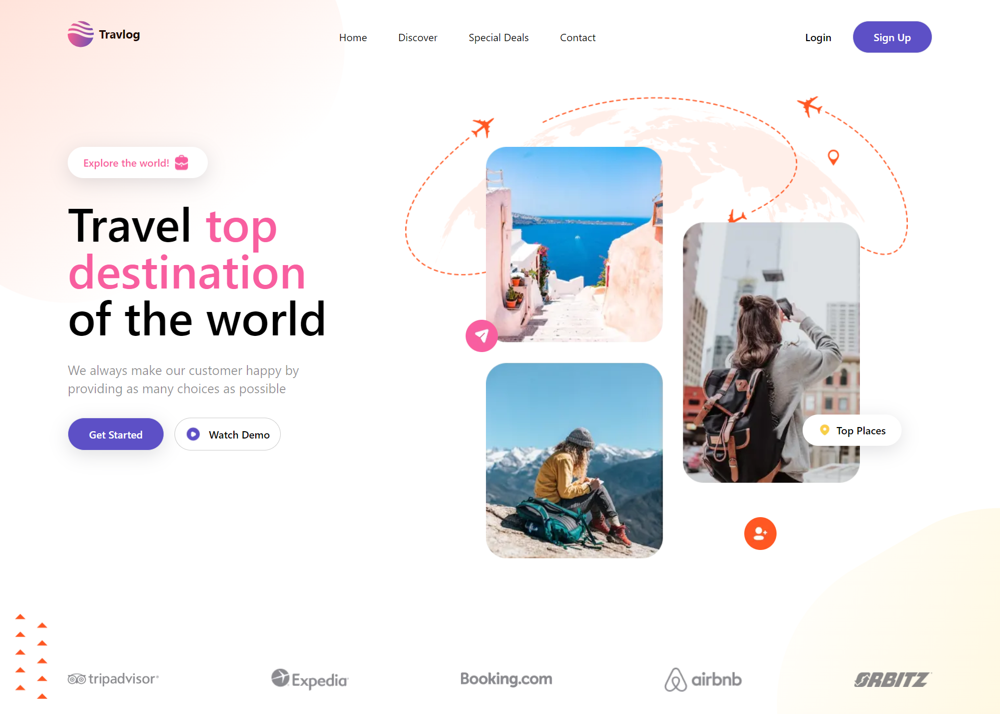

# Front End Travel Landing Page
It's been a long time since I get my hands on front end, lately I've been surrounded with javascript and C# which made me forget about front end. So here's a simple landing page I created for fun (still on going). This project is build with NextJS & typescript.

## Table of contents

- [Overview](#overview)
  - [The challenge](#the-challenge)
  - [Screenshot](#screenshot)
  - [Links](#links)
  - [Credit](#credit)
- [My process](#my-process)
  - [Built with](#built-with)
  - [What I learned](#what-i-learned)
  - [Continued development](#continued-development)
  - [Useful resources](#useful-resources)
- [Author](#author)
- [Getting Started](#getting-started)


## 🚨 Overview

### The challenge

- Build out the project to the designs provided
- Implementing card slider for 'top destination' section
- Playing with CSS Layout - The position Property (relative, absolute) to style background 

### Screenshot


### Links
[Live Site URL](https://travlog-landing-page-zeta.vercel.app/)

### Credit
[Figma Web Design & UI kit i used for this project](https://www.figma.com/file/5faP92Sa9LBCqmtwIcvVIk/Landing-Page-UI-Design-in-Figma-(Community)?type=design&t=d4D5mlw01KLHlElv-6)

## ⚙️ My process

### Built with

- Semantic HTML5 markup
- CSS custom properties
- Flexbox
- CSS Grid
- CSS Layout The position Property (relative, absolute)
- [Next JS](https://nextjs.org/) - React Framework for Production
- [Typescript](https://www.typescriptlang.org/) 
- [swiper js](https://swiperjs.com/) - JS library to add slider component

### What I learned

Coming soon

### Continued development
Coming soon

### Useful resources
- [UI/UX Design Resources](https://ui8.net/) - This website provide many UI/UX design, some are even free.
- [Build and Deploy a Fully Responsive Modern UI/UX Website | React.js, Next.js 13, Tailwind CSS by JavaScript Mastery](https://www.youtube.com/watch?v=cuzw4vL1z5E&list=PLX3rE0SL_PjHPmNDA1PVfR7_22pzEuW5T&index=13&t=3479s&ab_channel=JavaScriptMastery) 
- [Swiper React Components](https://swiperjs.com/react#styles)
- [Flowbite](https://www.flowbite-react.com/docs/components/carousel)

## Author
Github - [Shabrina Putri](https://github.com/shabrina12)

## 🤸 Getting Started

To run the development server:

```bash
npm run dev
```
